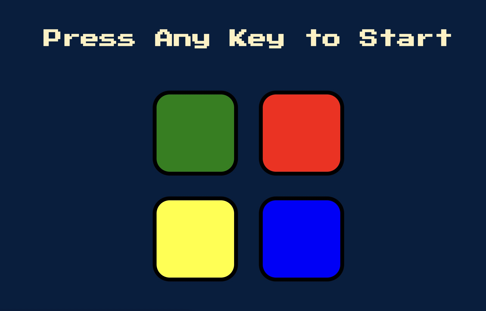
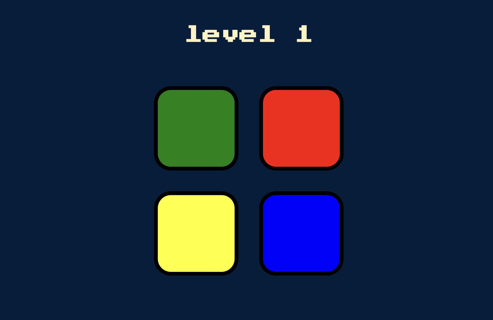
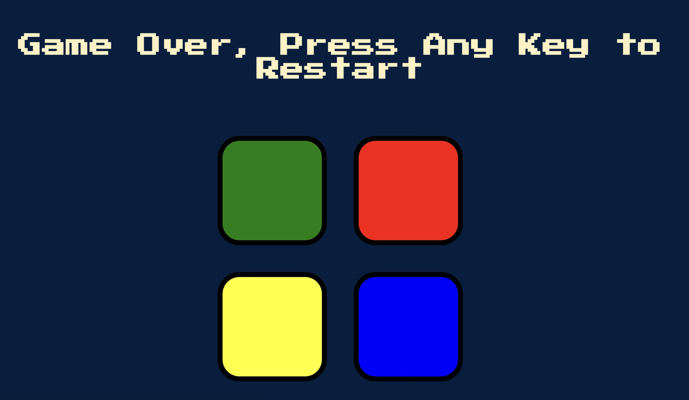

 

  

<h3 align="center">Simon Game</h3>
  

    Simple traditional Simon Game.
  

## About
The project is a part of my course in Udemy, I really enjoyed building it and I hope you will enjoy the game.

### Instructions
For those who don't know the game, it's a memory based game. 
before every level the game will present you the color you need to click, but  
you need to remember and click the same colors from the previous levels and at the end click the current one.

## Technologies used
- js, html & css

## Media

## Getting Started
just download the project files and open the index.html .

## Acknowledgements
I would like to thank to Dr. Angela Yu for creating the great course "The Complete 2023 Web Development Bootcamp"
> Link to the course [here](https://www.udemy.com/course/the-complete-web-development-bootcamp/?kw=The+Complete+2023+Web+Development+Bootcamp&src=sac)
